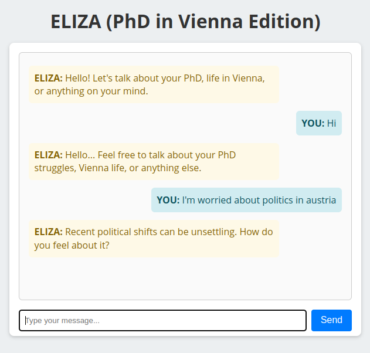

# ELIZA (PhD & Vienna Edition)

A **vintage** chatbot built using **classic ELIZA** techniques. This project focuses on:
- **PhD-related** stress or academic concerns  
- **Living in Vienna**  
- **Political/electoral** issues (e.g., far-right outcomes, local politics)  
- **Generic emotional support**

It uses **regex-based pattern matching** with synonyms, expansions, and repeated-input detection, plus a **reflection dictionary**. The conversation is **purely client-side** (via [Pyodide](https://pyodide.org/)) or **Python-based** in the console.

---

## Live Demo

Try it in your browser:  
[**Live demo**](https://tekayanidham.github.io/ai-history-assignment-2/)


---

## Screenshot

Below is a placeholder for **`ressources/demo.png`** showing an example conversation:




---

## Project Structure

1. **`index.html`**  
   - The **web version** of ELIZA.  
   - Loads **Pyodide** from a CDN.  
   - Embeds the entire knowledge base (regex rules + reflection) as a Python code string.  
   - Renders a chat UI (styling, input box, etc.).  
   - Handles repeated-input detection (via global Python variables) or purely in Python code.

2. **`main.py`**  
   - A **console-based** Python script.  
   - Demonstrates how to run the same rules & reflections locally (in a terminal).  
   - May contain repeated-input logic (e.g., checking if the user typed the same line consecutively).

3. **`eliza_knowledge.py`**  
   - Holds the **reflection dictionary** and **RULES** array for the Python console version.  
   - Imported by `main.py`.  
   - Regex expansions for synonyms, placeholders, fallback patterns.


---

## Usage

### 1) Web Version (`index.html`)

- **Open** `index.html` in a modern browser (Chrome, Firefox, etc.).  
- Wait a moment for Pyodide to load.  
- **Type** your message and press **Enter** or click **Send**.  
- The chatbot responds, referencing your **PhD**, **Vienna**, or **politics**.  

You can also **deploy** it on GitHub Pages by pushing this file to your repo’s main branch and enabling Pages under **Settings** → **Pages**. The project link above is an example of this deployment.

### 2) Console Version (`main.py`)

- **Install** Python 3 on your system.  
- **Clone** or download this repository.  
- **Open a terminal** in the repo folder.  
- Run:  
  ```bash
  python main.py

