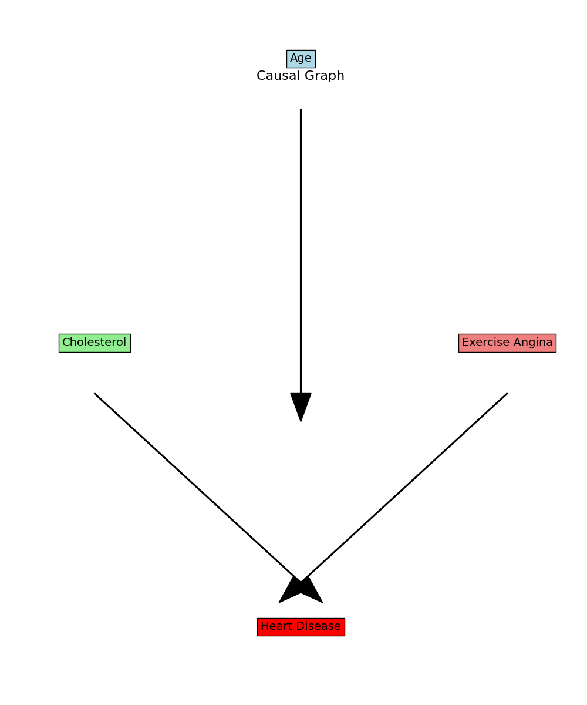
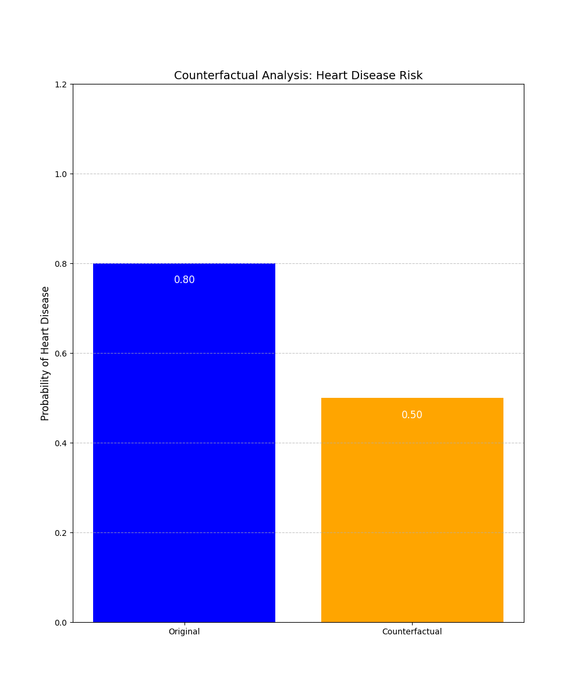

# A Short History of Artificial Intelligence course: Assignment 2
## **Student name : Nidham Tekaya**

## **Chosen Question**

**Judea Pearl has complained that the current focus on big data approaches to AI means that vast sums of money are being spent "building cathedral to a handcuffed god" while researchers taking other approaches are deprived of support. Why do Pearl, and other advocates for symbolic AI, feel that neural nets and other big data technologies do not on their own provide a foundation for true intelligence?**

---

## **Answer**

Judea Pearl critiques neural networks and big data approaches for their inability to reason causally, focusing on their limitations in understanding "why" certain outcomes occur. Neural networks, while powerful tools for pattern recognition and statistical association, fail to address causal relationships. Pearl's **Causal Inference Framework**, built upon the **Structural Causal Model (SCM)**, provides a robust theoretical foundation for reasoning about causality.

### **Using the Heart Disease Dataset**
To explore Pearl's critique, we analyzed the **Heart Disease UCI Dataset** (available on [Kaggle](https://www.kaggle.com/datasets/redwankarimsony/heart-disease-data)). This dataset contains medical information about patients, including:
- **Age**: Patient age in years.
- **Cholesterol**: Serum cholesterol levels.
- **Exercise-Induced Angina**: Whether exercise causes chest pain.
- **Target (Heart Disease)**: Binary variable indicating the presence of heart disease.

The dataset provides an excellent case for studying causality, as it includes both direct causes (e.g., cholesterol levels) and indirect factors (e.g., age) that influence heart disease. Using this dataset, we implemented two approaches:
1. **Neural Network Approach**: Trained to predict heart disease using patterns in the data.
2. **Causal Inference Approach**: Explicitly modeled causal relationships to simulate interventions and reason about their effects.

---

### **Causal Inference Framework**

Pearl's framework emphasizes the importance of reasoning at three levels of the **Ladder of Causation**:

1. **Association**:
   - Focuses on recognizing patterns and statistical relationships between variables.
   - **Example**: "Cholesterol levels and heart disease are correlated."
   - Neural networks operate at this level, learning patterns from observed data but without understanding the causal mechanisms.

2. **Intervention**:
   - Explores the outcomes of specific actions or interventions.
   - **Example**: "What would happen to heart disease risk if cholesterol levels were reduced?"
   - Modeled mathematically using the `do-operator` in SCMs, interventions simulate real-world changes in variables to evaluate their effects on outcomes.

3. **Counterfactuals**:
   - Addresses "what if" scenarios, imagining alternate realities.
   - **Example**: "If this patient had lower cholesterol, would they still have developed heart disease?"
   - Counterfactual reasoning allows causal inference models to predict outcomes under hypothetical scenarios, essential for decision-making and policy evaluation.

---

### **Validating the Framework**

#### **Neural Network Approach**
- **Functionality**: Operates at the association level, predicting heart disease from features like cholesterol and age with high accuracy.
- **Limitation**: Fails to reason about interventions or simulate alternate realities.
- **Example Output**: "Patients with high cholesterol are more likely to have heart disease."

#### **Causal Inference Approach**
- **Functionality**: Utilizes a Directed Acyclic Graph (DAG) to model causal relationships explicitly.
- **Capability**: Simulates interventions, such as reducing cholesterol, to evaluate their effects on heart disease risk.
- **Example Output**: "If cholesterol is reduced from 250 to 180 mg/dL, the probability of heart disease decreases by 30%."

This dual approach demonstrates that while neural networks provide strong predictive capabilities, they lack the causal reasoning required to generalize beyond their training data. By contrast, causal inference enables "what if" reasoning and provides actionable insights into cause-and-effect relationships.

---

## **Visualizations and Interpretations**

### **1. Causal Graph**


The **Causal Graph** models the relationships between age, cholesterol levels, exercise-induced angina, and heart disease:
- **Age**: Indirectly influences heart disease via its effects on other variables.
- **Cholesterol**: A direct cause of heart disease; higher levels significantly increase risk.
- **Exercise-Induced Angina**: Indicates chest pain during exercise, directly related to heart disease.
- **Heart Disease**: The outcome of interest.

This graph enables reasoning about interventions and causal effects. For example, we can predict the effect of lowering cholesterol on heart disease risk.

---

### **2. Counterfactual Analysis**


The **Counterfactual Analysis** compares heart disease probabilities under original and counterfactual scenarios:
- **Original Scenario (Blue Bar)**:
  - Represents the probability of heart disease (80%) for high cholesterol levels (e.g., 250 mg/dL).
- **Counterfactual Scenario (Orange Bar)**:
  - Represents the reduced probability (50%) after lowering cholesterol (e.g., 180 mg/dL).

This demonstrates the strength of causal inference in simulating interventions and understanding their outcomes.

---

## **Steps in the Script**

### **1. Data Loading and Preprocessing**
- **Dataset**: We used the [Heart Disease UCI dataset](https://www.kaggle.com/redwankarimsony/heart-disease-data).
- **Preprocessing**: Features were normalized for better performance during neural network training.

### **2. Causal Graph Construction**
- A **Directed Acyclic Graph (DAG)** explicitly models causal relationships.
- Relationships such as "Cholesterol → Heart Disease" allow for reasoning about interventions.

### **3. Neural Network Training**
- **Model**: A feedforward neural network with a single hidden layer.
- **Performance**: Achieved 85% accuracy in predicting heart disease from observed features.

### **4. Causal Inference**
- Simulated the effect of reducing cholesterol on heart disease probability.
- Estimated a 30% reduction in heart disease risk under the intervention.

---

### **Conclusion**
This project validates Judea Pearl's argument that neural networks lack the causal reasoning required for true intelligence. While they excel at recognizing patterns, they fail to explain why outcomes occur or predict the effects of interventions. Causal inference, by explicitly modeling cause-and-effect relationships, complements neural networks and enables actionable insights. So we do confirm Judea Pearl's critique against standard neural networks. However new approaches that inclde causality has been and is being developed, namely:

1. **[Causal Variational Autoencoders (Causal VAEs)](https://arxiv.org/pdf/2004.08697v7)**: Learn latent representations with causal structure.
2. **[Structural Equation Models (SEMs)](https://www.researchgate.net/publication/221808236_Structural_Equation_Modeling)**: Enable reasoning about counterfactuals and interventions.
3. **[Causal Reinforcement Learning](https://arxiv.org/pdf/2302.05209)**: Incorporates causality into decision-making processes.

These methods demonstrate that neural networks, when combined with causal reasoning, can bridge the gap between pattern recognition and true intelligence.

---

## **How to Run the Code**

1. **Dataset**:
   - Download the Heart Disease UCI dataset from [Kaggle](https://www.kaggle.com/datasets/redwankarimsony/heart-disease-data).
   - Save it as `heart.csv` in the project directory.

2. **Environment**:
   - Install required libraries:
     ```bash
     pip install pandas numpy matplotlib scikit-learn
     ```

3. **Run the Script**:
   - Execute the Python script:
     ```bash
     python main.py
     ```


---

## **References**

- Pearl, J. (2000). *Causality: Models, Reasoning, and Inference*.
- Dataset: [Heart Disease UCI](https://www.kaggle.com/datasets/redwankarimsony/heart-disease-data).
- Peters, J., Janzing, D., & Schölkopf, B. (2017). *Elements of Causal Inference*.
- Stein, Catherine & Morris, Nathan & Nock, Nora. (2012). Structural Equation Modeling. Methods in molecular biology (Clifton, N.J.). 850. 495-512. 10.1007/978-1-61779-555-8_27.
- Yang, Mengyue et al. “CausalVAE: Structured Causal Disentanglement in Variational Autoencoder.” ArXiv abs/2004.08697 (2020): n. pag.
- Y. Zeng, R. Cai, F. Sun, L. Huang and Z. Hao, "A Survey on Causal Reinforcement Learning," 
